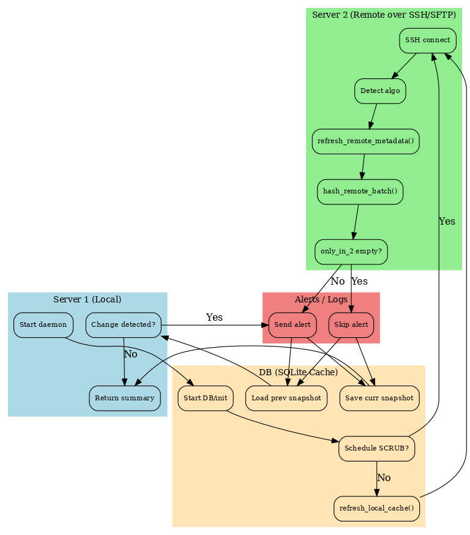

**Merge file storage** là tool sync/merge dữ liệu giữa hai server qua SSH, so khớp theo **hash** (SHA256 hoặc BLAKE3).  
Tool dùng **SQLite** làm cache metadata/hash để tăng tốc ở các vòng sau, có **hash budget** cho remote để tránh quá tải, **gửi cảnh báo** (Telegram/Email), ghi **log JSON** và metric **Prometheus metrics**.

---

## ✨ Tính năng chính

- **Sync incremental theo hash**: chỉ copy file mới hoặc file có sự thay đổi.
- **Hash budget remote**: giới hạn theo **số file** hoặc **tổng byte** mỗi lần check; **ưu tiên** re-hash file **stale** (khi `mtime` mới hơn `last_hashed`).
- **Xử lý conflict**:  
  - `skip`: bỏ qua nếu file đã tồn tại  
  - `overwrite`: ghi đè  
  - `suffix` / `version`: tạo **bản version theo timestamp** (không ghi đè bản cũ)
- **Bỏ qua thư mục `_logs`** ở **cả local và remote** khi quét metadata.
- **Tự re-hash khi metadata remote thay đổi**: nếu `size`/`mtime` đổi, hash cũ bị xóa để buộc tính lại.
- **Scrub định kỳ**: xác minh tính toàn vẹn dữ liệu bằng cách re-hash lại một phần ngẫu nhiên các file, kể cả khi metadata (size/mtime) không đổi.
- **Alert + Báo cáo**: Telegram/Email + log JSON + Prometheus metrics.
- **Hỗ trợ multi-root** trên remote (kèm alias) và merge vào subroot tùy chọn.

---

## 📦 Cài đặt

Yêu cầu: Python 3.7+

```bash
pip install paramiko requests blake3 prettytable tqdm
```

Remote cần `sha256sum` hoặc `b3sum` (nếu có `b3sum` sẽ ưu tiên **BLAKE3**).

> 🔐 **Bảo mật**: Không commit token/secret thực vào repo public.

---

## ⚙️ Cấu hình nhanh (trong `run.py`)

* Local: `SERVER1_ROOT`
* Remote: `SERVER2_HOST`, `SERVER2_PORT`, `SERVER2_USER`, `SERVER2_ROOTS`
* Auth: `SERVER2_PASSWORD` **hoặc** `SERVER2_KEY_FILE`
* Merge: `USE_MERGE_SUBROOT`, `ON_CONFLICT`
* Limit hash: `REMOTE_HASH_BUDGET_FILES`, `REMOTE_HASH_BUDGET_BYTES`
* Cache DB: `CACHE_DB` (SQLite)
* Alert: `ENABLE_TELEGRAM_ALERT`, `TELEGRAM_BOT_TOKEN`, `TELEGRAM_CHAT_ID`, `ENABLE_EMAIL_ALERT`, …

---

## 🚀 Cách chạy

* **One-shot** (một vòng rồi dừng):

  ```bash
  RUN_FOREVER=False python3 run.py
  ```

* **Daemon** (lặp lại theo `SLEEP_SECONDS`):

  ```bash
  python3 run.py
  ```

* **Logs**:
```bash
shell> python3 run.py 
🌀 Start daemon… mode (Ctrl+C to stop)
🔐 Shared hash algorithm: sha256
[remote-meta] /home/data: 36 files
📦 The JSON log is saved at: /home/data/_logs/merge_20250810-211437.json
✅ Copied: ssacl.new.sh -> ssacl.new.sh
✅ Copied: vz-iso-7.5.3-391.iso -> vz-iso-7.5.3-391.iso
✅ Copied: ceph_osd_summary.py -> ceph_osd_summary.py
✅ Copied: nginx/ssl_checker.sh -> nginx/ssl_checker.sh
✅ Copied: iso/ubuntu-18_04_6-live-server-amd64.iso -> iso/ubuntu-18_04_6-live-server-amd64.iso
✅ Copied: audit_vstor-hcm04_20250718_150347.log -> audit_vstor-hcm04_20250718_150347.log
✅ Copied: find_slowrequest.py -> find_slowrequest.py
✅ Copied: wg_site_setup.sh -> wg_site_setup.sh
✅ Copied: iso/manjaro-xfce-21.3.6-220729-linux515.iso -> iso/manjaro-xfce-21.3.6-220729-linux515.iso
✅ Copied: ssacli.old.sh -> ssacli.old.sh
✅ Copied: fake.sh -> fake.sh
✅ Copied: 2024_02_21_16_07_IMG_4851.MOV -> 2024_02_21_16_07_IMG_4851.MOV
✅ Copied: 2024_02_29_11_51_IMG_5007.MOV -> 2024_02_29_11_51_IMG_5007.MOV
✅ Copied: ceph.drawio -> ceph.drawio
✅ Copied: rbd_manager.py -> rbd_manager.py
✅ Copied: iso/ubuntu-22.04.1-live-server-amd64.iso -> iso/ubuntu-22.04.1-live-server-amd64.iso
✅ Copied: omreport.sh -> omreport.sh
✅ Copied: 2024_02_25_19_39_IMG_5006.MOV -> 2024_02_25_19_39_IMG_5006.MOV
✅ Copied: lldpNeighbors.py -> lldpNeighbors.py
✅ Copied: minio_benchmark.py -> minio_benchmark.py
✅ Copied: 2024_02_17_06_27_IMG_4828.MOV -> 2024_02_17_06_27_IMG_4828.MOV
✅ Copied: 2024_03_02_07_34_IMG_5265.MOV -> 2024_03_02_07_34_IMG_5265.MOV
✅ Copied: ceph_bench_pool.sh -> ceph_bench_pool.sh
✅ Copied: 2024_03_03_18_57_IMG_5320.MOV -> 2024_03_03_18_57_IMG_5320.MOV
✅ Copied: audit.py -> audit.py
✅ Copied: nginx/zabbix.systemd.sh -> nginx/zabbix.systemd.sh
✅ Copied: ceph_pg_object_summary.sh -> ceph_pg_object_summary.sh
✅ Copied: large.sh -> large.sh
✅ Copied: 2024_02_11_19_19_IMG_4346_1_Edit.mp4 -> 2024_02_11_19_19_IMG_4346_1_Edit.mp4
✅ Copied: ceph_clear_data.sh -> ceph_clear_data.sh
✅ Copied: bench.sh -> bench.sh
✅ Copied: osd-reweight-down.sh -> osd-reweight-down.sh
✅ Copied: 2024_02_19_07_24_IMG_4832.MOV -> 2024_02_19_07_24_IMG_4832.MOV
✅ Copied: chrome32_49.0.2623.75.exe -> chrome32_49.0.2623.75.exe
✅ Copied: getSystemInfo.py -> getSystemInfo.py
✅ Copied: cephadm_ssh_checker.py -> cephadm_ssh_checker.py
📦 The JSON log is saved at: /home/data/_logs/merge_20250810-211437.json
📈 Metrics Prometheus recorded at: /var/lib/node_exporter/textfile_collector/merge_compare.prom
{"ok":true,"result":{"message_id":9420,"from":{"id":7509858733,"is_bot":true,"first_name":"Alert Demo","username":"alerts_demo_bot"},"chat":{"id":-4572608076,"title":"Alert Demo","type":"group","all_members_are_administrators":true,"accepted_gift_types":{"unlimited_gifts":false,"limited_gifts":false,"unique_gifts":false,"premium_subscription":false}},"date":1754835425,"document":{"file_name":"merge_20250810-211437.json","mime_type":"application/json","file_id":"BQACAgUAAxkDAAIkzGiYqeEen9FWKPdY-j1r-x3Ef960AAJVHQACYEjBVIDYuknjvDXgNgQ","file_unique_id":"AgADVR0AAmBIwVQ","file_size":15994},"caption":"[Merge Alert] 2025-08-10 21:17:04\nRun ID            : 20250810-211436\nSource Host       : 10.237.7.75\nSource Roots      : /home/data\nTarget Root       : /home/data\nUse Merge Subroot : False\nOn Conflict       : version\n------------------------------\nPlanned           : 36 files, 8.695.346.556 bytes (8.1 GB)\nCopied            : 36 files, 8.695.346.556 bytes (8.1 GB)\nFailed            : 0 files, 0 bytes (0.0 B)\nConflict          : 0 files, 0 bytes (0.0 B)\nDuration          : 147.034 s\nThroughput        : 59.138.339 B/s (56.4 MB/s)\n------------------------------\nLog JSON          : /home/data/_logs/merge_20250810-211437.json","caption_entities":[{"offset":0,"length":628,"type":"pre"}]}}🔐 Shared hash algorithm: sha256
[remote-meta] /home/data: 36 files
✅ There is no unique (hashed) file to merge in this round.
ℹ️ No planned/failed/conflict — skip sending alert.
🔐 Shared hash algorithm: sha256
[remote-meta] /home/data: 36 files
✅ There is no unique (hashed) file to merge in this round.
ℹ️ No new changes since last time — no alert sent.
🔐 Shared hash algorithm: sha256
[remote-meta] /home/data: 36 files
✅ There is no unique (hashed) file to merge in this round.
ℹ️ No new changes since last time — no alert sent.
🔐 Shared hash algorithm: sha256
[remote-meta] /home/data: 36 files
✅ There is no unique (hashed) file to merge in this round.
ℹ️ No new changes since last time — no alert sent.
🔐 Shared hash algorithm: sha256
[remote-meta] /home/data: 36 files
✅ There is no unique (hashed) file to merge in this round.
ℹ️ No new changes since last time — no alert sent.
🔐 Shared hash algorithm: sha256
[remote-meta] /home/data: 36 files
✅ There is no unique (hashed) file to merge in this round.
ℹ️ No new changes since last time — no alert sent.
```

---

Flow hiện tại sẽ chạy tách 3 phần: **Main loop**, **one\_shot()**, và **confirm\_and\_merge()**.



# Main loop (daemon)

```
┌───────────────────────────────────────────────────────────────────────────┐
│ S0. START (daemon/one-shot)                                               │
└───────┬───────────────────────────────────────────────────────────────────┘
        │
        │  mỗi 1h
        v
┌───────────────────────────────┐
│ S1. prune_deleted_records()   │
│     (TTL 7 ngày, theo code)   │
└───────┬───────────────────────┘
        │
        │  đến giờ SCRUB hàng ngày?
        ├─────────────── yes ─────────────────────────────────────────────┐
        │                                                                 │
        v                                                                 v
┌───────────────────────────────┐                           ┌───────────────────────────────┐
│ S2a. run_scrub_local()        │                           │ S2b. run_scrub_remote()       │
│  • pick ngẫu nhiên            │                           │  • pick ngẫu nhiên            │
│  • re-hash + update DB        │                           │  • b3sum/sha256sum + update   │
└───────────────────────────────┘                           └───────────────────────────────┘
        │                                                                 │
        └─────────────────────────────────────────────────────────────────┘
        │
        v
┌───────────────────────────────────────────────────────────────────────────┐
│ S3. Tạo run_id → gọi one_shot(run_id)                                     │
└───────┬───────────────────────────────────────────────────────────────────┘
        │ (nhận summary: copied/failed/conflict + only_in_2_relpaths)
        v
┌───────────────────────────────────────────────────────────────────────────┐
│ S13. Đọc snapshot cũ (_logs/_state.json)                                  │
│ S14. Lưu snapshot mới (only_in_2_relpaths vòng này)                       │
│ S15. Nếu snapshot đổi HOẶC có copied/failed/conflict > 0 → ALERT          │
│      (Telegram/Email + đính JSON log)                                     │
└───────┬───────────────────────────────────────────────────────────────────┘
        │
        v
┌───────────────────────────────────────────────────────────────────────────┐
│ S16. sleep(SLEEP_SECONDS) → lặp lại từ S1                                 │
└───────────────────────────────────────────────────────────────────────────┘
```

# one\_shot(run\_id)

```
┌───────────────────────────────────────────────────────────────────────────┐
│ S4. SSH connect (paramiko) → server2                                      │
│     thất bại? → return None                                               │
└───────┬───────────────────────────────────────────────────────────────────┘
        │
        v
┌─────────────────────────────────────────┐
│ S5. detect_remote_hash_algo()           │
│     • có b3sum? → "blake3" else "sha256"│
└───────┬─────────────────────────────────┘
        │
        v
┌─────────────────────────────────────────┐
│ S6. cycle_ts = _now()                   │
│     (mốc lọc last_seen >= cycle_ts)     │
└───────┬─────────────────────────────────┘
        │
        v
┌───────────────────────────────────────────────────────────────────────────┐
│ S7. refresh_local_cache()                                                 │
│   • scan_local_metadata()  (bỏ *_logs)                                    │
│   • nếu file "dirty" → compute_hash_local()                               │
│   • UPSERT filemeta_local: size, mtime, hash, last_seen=cycle_ts          │
└───────┬───────────────────────────────────────────────────────────────────┘
        │
        v
┌───────────────────────────────────────────────────────────────────────────┐
│ S8. refresh_remote_metadata()                                             │
│   • find (bỏ *_logs) → (rel, size, mtime)                                 │
│   • UPSERT filemeta_remote: size, mtime, giữ hash nếu metadata không đổi, │
│     last_seen=cycle_ts                                                    │
└───────┬───────────────────────────────────────────────────────────────────┘
        │
        v
┌───────────────────────────────────────────────────────────────────────────┐
│ S9. _choose_remote_to_hash_budget()                                       │
│   • Chọn file cần hash: hash NULL / last_hashed NULL / last_hashed < mtime│
│   • Ưu tiên stale/đã đổi → rồi theo size (theo code hiện tại)             │
│   • Giới hạn bởi REMOTE_HASH_BUDGET_*                                     │
└───────┬───────────────────────────────────────────────────────────────────┘
        │ danh sách cần hash
        v
┌───────────────────────────────────────────────────────────────────────────┐
│ S10. hash_remote_batch()                                                  │
│   • chạy b3sum/sha256sum theo batch                                       │
│   • UPDATE hash, last_hashed                                              │
└───────┬───────────────────────────────────────────────────────────────────┘
        │
        v
┌───────────────────────────────────────────────────────────────────────────┐
│ S11. compute_planned(min_last_seen=cycle_ts)                              │
│   • gather_local_hashes(last_seen>=cycle_ts)                              │
│   • list_remote_hashed(last_seen>=cycle_ts)                               │
│   • only_in_2 = HASH(remote) - HASH(local)                                │
│   • planned_stats (files/bytes)                                           │
└───────┬───────────────────────────────────────────────────────────────────┘
        │
        ├─────────────── only_in_2 rỗng? ──────────────── yes ──▶ return summary
        │                                                     (không merge)
        │ no
        v
┌───────────────────────────────────────────────────────────────────────────┐
│ S12. confirm_and_merge()                                                  │
│   • Ghi JSON log “pending”                                                │
│   • Lặp từng file planned: (→ xem chi tiết ở sơ đồ dưới)                  │
│   • Tổng kết copied/failed/conflict, duration, throughput                 │
│   • save_json_log(), write_prometheus_metrics()                           │
└───────────────────────────────────────────────────────────────────────────┘
```

# confirm\_and\_merge() (chi tiết từng file)

```
┌───────────────────────────────────────────────────────────────────────────┐
│ Input:                                                                    │
│  • planned (hash → [rel])   • rel_origin[rel] = (origin_root, alias, rel) │
│  • remote_rel_size[rel]     • ON_CONFLICT (skip/overwrite/version/suffix) │
└───────────────┬───────────────────────────────────────────────────────────┘
                │
                v
        ┌─────────────────────────────────────────────────────────────────┐
        │ Khởi tạo: dest_base, logs_dir, tạo meta + JSON “pending”        │
        └───────────────┬─────────────────────────────────────────────────┘
                        │
                        v
                ┌─────────────────────────────────────────────────────────┐
                │ FOR từng (hash → list rel_path) & từng rel_path:        │
                └───────────────┬─────────────────────────────────────────┘
                                │
                                v
                   ┌────────────────────────────────────────────┐
                   │ Tính src_remote (origin_root + orig_rel)   │
                   │ Tính dest_local (dest_base + rel_path)     │
                   └───────────────┬────────────────────────────┘
                                   │
                     dest_local đã tồn tại?
                     ├─────────────── yes ────────────────────────────────────────────────┐
                     │                                                                    │
                     │   ON_CONFLICT = skip    → mark skipped_conflict; next file         │
                     │   ON_CONFLICT = overwrite → giữ nguyên dest_local (sẽ ghi đè)      │
                     │   Khác (version/suffix) →                                          │
                     │     • cố lấy mtime remote (sftp.stat)                              │
                     │     • dest_local = conflict_suffix_path(dest_local, mtime_remote)  │
                     └────────────────────────────────────────────────────────────────────┘
                                   │
                                   v
                   ┌────────────────────────────────────────────┐
                   │ sftp.stat(src_remote) còn tồn tại?         │
                   └───────┬────────────────────────────────────┘
                           │ no
                           v
                   ┌────────────────────────────────────────────┐
                   │ mark failed_missing_remote; lưu lỗi; next  │
                   └────────────────────────────────────────────┘

                           │ yes
                           v
                   ┌────────────────────────────────────────────┐
                   │ sftp.get(src_remote, dest_local)           │
                   │ cố gắng set mtime = mtime_remote (os.utime)│
                   └───────┬────────────────────────────────────┘
                           │
                           v
                   ┌────────────────────────────────────────────┐
                   │ Nếu tên đích có “.conflict”/“.vYYYY…”      │
                   │   → mark conflict_versioned                │
                   │ Else → mark copied                         │
                   └────────────────────────────────────────────┘
```

> Ghi chú: mọi thống kê (files/bytes), JSON log chi tiết và Prometheus metrics đều được cập nhật cuối vòng `confirm_and_merge()`; sau đó main loop sẽ xét snapshot để quyết định gửi ALERT.

---

## 🧭 Cơ chế xử lý

* **Mốc vòng `cycle_ts`**: mọi tính toán planned đều lọc theo `last_seen >= cycle_ts` ⇒ chỉ lấy các file planned hiện tại; mọi thứ không thấy ở vòng này coi như bỏ qua.
* **Remote `_logs` bị bỏ qua** khi liệt kê bằng `find`: không lẫn log/cstate vào đồng bộ.
* **Re-hash ưu tiên file stale**: `_choose_remote_to_hash_budget()` chọn file `hash IS NULL` hoặc `last_hashed < mtime`, ưu tiên stale trước, rồi sắp theo `size DESC` đến khi hết quota.
* **Khi metadata remote đổi** (`size`/`mtime`), `refresh_remote_metadata()` sẽ xóa hash cũ trong DB để buộc tính lại.
* **Conflict → version theo timestamp**: nếu `ON_CONFLICT` là `suffix`/`version`, file đích sẽ được đổi tên kiểu:
  `data.tar.gz` → `data.vYYYYMMDD-HHMMSS.tar.gz` (nếu trùng nữa sẽ thêm `-2`, `-3`, …).
  Như vậy nó **giữ cả hai phiên bản**, không ghi đè bản cũ.

> ℹ️ Với cấu hình hash budget, các file mới trên remote có thể được phát hiện qua **nhiều vòng** (hash dần), nên có hiện tượng vòng 1 copy một phần, vòng 2 copy nốt.

---

## 📦 Thông tin về Database

### DB sẽ có **hai bảng**:

* `filemeta_local` — cache cho **local (server1)**
* `filemeta_remote` — cache cho **remote (server2)**

### Xem danh sách bảng & schema

```bash
shell> sqlite3 /var/tmp/merge_hash_cache.sqlite ".tables"
filemeta_local   filemeta_remote

shell> sqlite3 /var/tmp/merge_hash_cache.sqlite ".schema filemeta_local"
CREATE TABLE filemeta_local(
            root TEXT, rel TEXT, size INTEGER, mtime INTEGER,
            algo TEXT, hash TEXT, last_seen INTEGER, last_hashed INTEGER,
            PRIMARY KEY(root, rel, algo)
        );
CREATE INDEX idx_local_algo_hash ON filemeta_local(algo, hash);
CREATE INDEX idx_local_last_seen ON filemeta_local(last_seen);

shell> sqlite3 /var/tmp/merge_hash_cache.sqlite ".schema filemeta_remote"
CREATE TABLE filemeta_remote(
            host TEXT, root TEXT, rel TEXT, size INTEGER, mtime INTEGER,
            algo TEXT, hash TEXT, last_seen INTEGER, last_hashed INTEGER,
            PRIMARY KEY(host, root, rel, algo)
        );
CREATE INDEX idx_remote_algo_hash ON filemeta_remote(algo, hash);
CREATE INDEX idx_remote_last_seen ON filemeta_remote(last_seen);
```

### Xem vài bản ghi đầu

```bash
shell> sqlite3 -header -column /var/tmp/merge_hash_cache.sqlite \
"SELECT * FROM filemeta_local LIMIT 10;"
root        rel                                      size        mtime       algo    hash                                                              last_seen   last_hashed
----------  ---------------------------------------  ----------  ----------  ------  ----------------------------------------------------------------  ----------  -----------
/home/data  manjaro-xfce-21.3.6-220729-linux515.iso  3529039872  1754793215  sha256  a2be725e95f8ca6f1f70078ee210e5cf7bae483f638f1e97bbc944625cbe67c4  1754811351  1754795573 
/home/data  ceph_pg_object_summary.sh                2876        1754761760  sha256  ab57be9b0eee09a025c424eebe48819048d52dd6b40bab072b10c9270c5985d5  1754833978  1754795741 
/home/data  ceph.drawio                              129923      1754761760  sha256  a7268fdb1f79026d2f63cb6782ca4c09d05e6a1073b8f7eab4013e90dbc7fcb5  1754833978  1754795741 
/home/data  osd-reweight-down.sh                     4369        1754761761  sha256  6a3ddb949a682df7730e71aac061adbe57746465122e18d0e3c3a07966105950  1754833978  1754795741 
/home/data  ssacli.old.sh                            4277        1754761761  sha256  49d91c3069bab6227e1a3fb94b727d69a623f2ccaf76bcdec4e86e099d587684  1754833978  1754795741 
/home/data  ceph_osd_summary.py                      2395        1754761760  sha256  27be4c3c6c5bb86ddde4597fb21ed62be4cd926cd4ae8b821fca50917f05839a  1754833978  1754795741 
/home/data  lldpNeighbors.py                         8382        1754761761  sha256  4bfeef7d1263129951a3a852a1a1da555b305b1b5e34f9ce3aae60cd74518c1f  1754833978  1754795741 
/home/data  audit_vstor-hcm04_20250718_150347.log    7817        1754761760  sha256  7e8b735a0c3e4aa3216a23017eaf1e25789f7a3c7e5a8c6c6b3a6ebb6b7ef223  1754833978  1754795741 
/home/data  ubuntu-18_04_6-live-server-amd64.iso     1016070144  1754792953  sha256  6c647b1ab4318e8c560d5748f908e108be654bad1e165f7cf4f3c1fc43995934  1754811351  1754795741 
/home/data  2024_02_11_19_19_IMG_4346_1_Edit.mp4     164515010   1754766600  sha256  c67ee73b781138ff7cf916bd48d3bfa6254d6e2f2208aec03ec694dd678d5b9e  1754833978  1754795741

shell> sqlite3 -header -column /var/tmp/merge_hash_cache.sqlite \
"SELECT * FROM filemeta_remote LIMIT 10;"
host         root        rel                                    size        mtime       algo    hash                                                              last_seen   last_hashed
-----------  ----------  -------------------------------------  ----------  ----------  ------  ----------------------------------------------------------------  ----------  -----------
10.237.7.75  /home/data  bench.sh                               7090        1754827993  sha256  3034d3017da090db0d1ba4729372d1d7c5e47d7afdd5dbf29083825d7f134824  1754834009  1754828015 
10.237.7.75  /home/data  ceph_pg_object_summary.sh              2876        1754761760  sha256  ab57be9b0eee09a025c424eebe48819048d52dd6b40bab072b10c9270c5985d5  1754834009  1754795582 
10.237.7.75  /home/data  ceph.drawio                            129923      1754761760  sha256  a7268fdb1f79026d2f63cb6782ca4c09d05e6a1073b8f7eab4013e90dbc7fcb5  1754834009  1754795582 
10.237.7.75  /home/data  osd-reweight-down.sh                   4369        1754761761  sha256  6a3ddb949a682df7730e71aac061adbe57746465122e18d0e3c3a07966105950  1754834009  1754795582 
10.237.7.75  /home/data  ssacli.old.sh                          4277        1754761761  sha256  49d91c3069bab6227e1a3fb94b727d69a623f2ccaf76bcdec4e86e099d587684  1754834009  1754795582 
10.237.7.75  /home/data  ceph_osd_summary.py                    2395        1754761760  sha256  27be4c3c6c5bb86ddde4597fb21ed62be4cd926cd4ae8b821fca50917f05839a  1754834009  1754795582 
10.237.7.75  /home/data  lldpNeighbors.py                       8382        1754761761  sha256  4bfeef7d1263129951a3a852a1a1da555b305b1b5e34f9ce3aae60cd74518c1f  1754834009  1754795582 
10.237.7.75  /home/data  audit_vstor-hcm04_20250718_150347.log  7817        1754761760  sha256  7e8b735a0c3e4aa3216a23017eaf1e25789f7a3c7e5a8c6c6b3a6ebb6b7ef223  1754834009  1754795582 
10.237.7.75  /home/data  ubuntu-18_04_6-live-server-amd64.iso   1016070144  1754792953  sha256  6c647b1ab4318e8c560d5748f908e108be654bad1e165f7cf4f3c1fc43995934  1754811351  1754795582 
10.237.7.75  /home/data  2024_02_11_19_19_IMG_4346_1_Edit.mp4   164515010   1754766600  sha256  c67ee73b781138ff7cf916bd48d3bfa6254d6e2f2208aec03ec694dd678d5b9e  1754834009  1754795582
```

### Một số truy vấn khác

* Local: các file đã hash

```bash
shell> sqlite3 -header -column /var/tmp/merge_hash_cache.sqlite \
"SELECT root,rel,size,mtime,algo,substr(hash,1,12) AS hash12,last_hashed FROM filemeta_local WHERE hash IS NOT NULL LIMIT 20;"
root        rel                                      size        mtime       algo    hash12        last_hashed
----------  ---------------------------------------  ----------  ----------  ------  ------------  -----------
/home/data  manjaro-xfce-21.3.6-220729-linux515.iso  3529039872  1754793215  sha256  a2be725e95f8  1754795573 
/home/data  ceph_pg_object_summary.sh                2876        1754761760  sha256  ab57be9b0eee  1754795741 
/home/data  ceph.drawio                              129923      1754761760  sha256  a7268fdb1f79  1754795741 
/home/data  osd-reweight-down.sh                     4369        1754761761  sha256  6a3ddb949a68  1754795741 
/home/data  ssacli.old.sh                            4277        1754761761  sha256  49d91c3069ba  1754795741 
/home/data  ceph_osd_summary.py                      2395        1754761760  sha256  27be4c3c6c5b  1754795741 
/home/data  lldpNeighbors.py                         8382        1754761761  sha256  4bfeef7d1263  1754795741 
/home/data  audit_vstor-hcm04_20250718_150347.log    7817        1754761760  sha256  7e8b735a0c3e  1754795741 
/home/data  ubuntu-18_04_6-live-server-amd64.iso     1016070144  1754792953  sha256  6c647b1ab431  1754795741 
/home/data  2024_02_11_19_19_IMG_4346_1_Edit.mp4     164515010   1754766600  sha256  c67ee73b7811  1754795741 
/home/data  ceph_bench_pool.sh                       1587        1754761760  sha256  b7c88153aeac  1754795741 
/home/data  vz-iso-7.5.3-391.iso                     2376044544  1754769506  sha256  97f07a1d12ed  1754795741 
/home/data  2024_02_25_19_39_IMG_5006.MOV            24531402    1754766521  sha256  1050682aa205  1754795741 
/home/data  wg_site_setup.sh                         4825        1754766418  sha256  479feb395129  1754795741 
/home/data  2024_03_02_07_34_IMG_5265.MOV            6135644     1754766524  sha256  e8349771649e  1754795741 
/home/data  getSystemInfo.py                         7224        1754761761  sha256  6cb40c51ddc3  1754795741 
/home/data  cephadm_ssh_checker.py                   4422        1754761760  sha256  49153a816878  1754795741 
/home/data  minio_benchmark.py                       4880        1754761761  sha256  d7191306b55f  1754795741 
/home/data  audit.py                                 41252       1754762077  sha256  524bd8f65071  1754795741 
/home/data  chrome32_49.0.2623.75.exe                43098374    1754791618  sha256  9e6f3020d25e  1754795741 
```

* Remote: các file **chưa** được hash (sẽ được hash dần theo budget)

```bash
shell> sqlite3 -header -column /var/tmp/merge_hash_cache.sqlite \
"SELECT host,root,rel,size,mtime FROM filemeta_remote WHERE hash IS NULL LIMIT 20;"
```

* Đếm tổng số file theo phía:

```bash
shell> sqlite3 /var/tmp/merge_hash_cache.sqlite \
"SELECT 'local' side, COUNT(*) FROM filemeta_local
 UNION ALL
 SELECT 'remote', COUNT(*) FROM filemeta_remote;"
local|41
remote|40
```

* Những file remote đã có hash (dùng để lập kế hoạch merge):

```bash
shell> sqlite3 -header -column /var/tmp/merge_hash_cache.sqlite \
"SELECT host,root,rel,size,substr(hash,1,12) hash12,last_hashed
 FROM filemeta_remote WHERE hash IS NOT NULL LIMIT 20;"
host         root        rel                                    size        hash12        last_hashed
-----------  ----------  -------------------------------------  ----------  ------------  -----------
10.237.7.75  /home/data  bench.sh                               7090        3034d3017da0  1754828015 
10.237.7.75  /home/data  ceph_pg_object_summary.sh              2876        ab57be9b0eee  1754795582 
10.237.7.75  /home/data  ceph.drawio                            129923      a7268fdb1f79  1754795582 
10.237.7.75  /home/data  osd-reweight-down.sh                   4369        6a3ddb949a68  1754795582 
10.237.7.75  /home/data  ssacli.old.sh                          4277        49d91c3069ba  1754795582 
10.237.7.75  /home/data  ceph_osd_summary.py                    2395        27be4c3c6c5b  1754795582 
10.237.7.75  /home/data  lldpNeighbors.py                       8382        4bfeef7d1263  1754795582 
10.237.7.75  /home/data  audit_vstor-hcm04_20250718_150347.log  7817        7e8b735a0c3e  1754795582 
10.237.7.75  /home/data  ubuntu-18_04_6-live-server-amd64.iso   1016070144  6c647b1ab431  1754795582 
10.237.7.75  /home/data  2024_02_11_19_19_IMG_4346_1_Edit.mp4   164515010   c67ee73b7811  1754795582 
10.237.7.75  /home/data  ceph_bench_pool.sh                     1587        b7c88153aeac  1754795582 
10.237.7.75  /home/data  vz-iso-7.5.3-391.iso                   2376044544  97f07a1d12ed  1754795582 
10.237.7.75  /home/data  2024_02_25_19_39_IMG_5006.MOV          24531402    1050682aa205  1754795582 
10.237.7.75  /home/data  wg_site_setup.sh                       4825        479feb395129  1754795582 
10.237.7.75  /home/data  nginx/ssl_checker.sh                   1821        371611c3fda0  1754795582 
10.237.7.75  /home/data  nginx/zabbix.systemd.sh                2043        8b98f2e12715  1754795582 
10.237.7.75  /home/data  2024_03_02_07_34_IMG_5265.MOV          6135644     e8349771649e  1754795582 
10.237.7.75  /home/data  getSystemInfo.py                       7224        6cb40c51ddc3  1754795582 
10.237.7.75  /home/data  cephadm_ssh_checker.py                 4422        49153a816878  1754795582 
10.237.7.75  /home/data  minio_benchmark.py                     4880        d7191306b55f  1754795582 
```

---

### Nếu hai bảng vẫn trống

Check nhanh vài điểm:

1. **Đường dẫn DB đúng chưa?** (mặc định `/var/tmp/merge_hash_cache.sqlite`)
   Bạn có sửa `CACHE_DB` trong code không?

2. **Quyền ghi**: process có ghi được vào `/var/tmp` không? (Bạn chạy `root` thì OK.)

3. **Code đã chạy `db_init()` chưa?**
   Trong file mình gửi, `main()` gọi `db_init()` ngay đầu; nếu bạn chỉnh tay, đảm bảo vẫn gọi.

4. **Log vòng lặp**:

   * Có dòng `🏠 Local hashed/updated: N file` chưa? Nếu có, `filemeta_local` phải có dữ liệu.
   * Có dòng `[remote-meta] /path: N files` chưa? Nếu có, `filemeta_remote` phải có **ít nhất** metadata.
   * Có dòng `🌐 Remote hashed this round: N file` chưa? Nếu có, `filemeta_remote.hash` sẽ dần có dữ liệu.

---

## 🧾 Log & Metrics

* **JSON log**: tại `SERVER1_ROOT/merge_from_server2/_logs/merge_*.json`
  Ghi lại danh sách hash → các path liên quan, cùng `status` (`copied`, `failed`, `skipped_conflict`, `conflict_versioned`, …), kích thước và lỗi (nếu có).

Ví dụ cho logfile
```log
{
  "hashes": [
    {
      "hash": "3034d3017da090db0d1ba4729372d1d7c5e47d7afdd5dbf29083825d7f134824",
      "duplicates": [
        {
          "path": "bench.sh",
          "status": "conflict_versioned",
          "source_alias": "data",
          "origin_root": "/home/data",
          "src_remote": "/home/data/bench.sh",
          "dest": "bench.v20250810-191313.sh",
          "bytes": 7090,
          "note": "created versioned copy due to conflict"
        }
      ]
    }
  ],
  "meta": {
    "started_at": "2025-08-10T19:13:35.020335",
    "source_host": "10.237.7.75",
    "source_roots": [
      "/home/data"
    ],
    "target_root": "/home/data",
    "use_merge_subroot": false,
    "dest_base": "/home/data",
    "run_id": "20250810-191334",
    "planned_files": 1,
    "planned_bytes": 7090,
    "target_fs_total_bytes": 50403627008,
    "target_fs_used_bytes": 15611781120,
    "target_fs_free_bytes": 32198299648,
    "on_conflict": "version",
    "finished_at": "2025-08-10T19:13:35.073383",
    "copied_files": 0,
    "copied_bytes": 0,
    "failed_files": 0,
    "failed_bytes": 0,
    "conflict_files": 1,
    "conflict_bytes": 7090,
    "duration_seconds": 0.053,
    "throughput_bytes_per_second": 0.0
  },
  "summary": {
    "files_by_status": {
      "conflict_versioned": 1
    },
    "bytes_by_status": {
      "conflict_versioned": 7090
    }
  }
}
```

* **Prometheus metrics** (Textfile Collector) ghi `merge_compare.prom`, gồm:
  `merge_unique_files_total`, `merge_unique_bytes_total`,
  `merge_files_copied_total`, `merge_bytes_copied_total`,
  `merge_files_failed_total`, `merge_bytes_failed_total`,
  `merge_files_conflict_total`, `merge_bytes_conflict_total`,
  `merge_last_run_timestamp_seconds`.

Ví dụ cho metric
```log
merge_unique_files_total{source_host="10.237.7.75",target_root="/home/data",run_id="20250810-191334",source_roots="/home/data",source_aliases="data"} 1
merge_unique_bytes_total{source_host="10.237.7.75",target_root="/home/data",run_id="20250810-191334",source_roots="/home/data",source_aliases="data"} 7090
merge_files_copied_total{source_host="10.237.7.75",target_root="/home/data",run_id="20250810-191334",source_roots="/home/data",source_aliases="data"} 0
merge_bytes_copied_total{source_host="10.237.7.75",target_root="/home/data",run_id="20250810-191334",source_roots="/home/data",source_aliases="data"} 0
merge_files_failed_total{source_host="10.237.7.75",target_root="/home/data",run_id="20250810-191334",source_roots="/home/data",source_aliases="data"} 0
merge_bytes_failed_total{source_host="10.237.7.75",target_root="/home/data",run_id="20250810-191334",source_roots="/home/data",source_aliases="data"} 0
merge_files_conflict_total{source_host="10.237.7.75",target_root="/home/data",run_id="20250810-191334",source_roots="/home/data",source_aliases="data"} 1
merge_bytes_conflict_total{source_host="10.237.7.75",target_root="/home/data",run_id="20250810-191334",source_roots="/home/data",source_aliases="data"} 7090
merge_last_run_timestamp_seconds{source_host="10.237.7.75",target_root="/home/data",run_id="20250810-191334",source_roots="/home/data",source_aliases="data"} 1754828015
```

---

## 🔔 Alert

Gửi Telegram/Email khi:

* Có planned > 0 (file mới),
* Hoặc có `copied/failed/conflict > 0`,
* Hoặc snapshot thay đổi so với vòng trước.

Không có thay đổi ⇒ **không** gửi (tránh spam).

Ví dụ cho alert Telegram
```log
[Merge Alert] 2025-08-10 21:17:04
Run ID            : 20250810-211436
Source Host       : 10.237.7.75
Source Roots      : /home/data
Target Root       : /home/data
Use Merge Subroot : False
On Conflict       : version
------------------------------
Planned           : 36 files, 8.695.346.556 bytes (8.1 GB)
Copied            : 36 files, 8.695.346.556 bytes (8.1 GB)
Failed            : 0 files, 0 bytes (0.0 B)
Conflict          : 0 files, 0 bytes (0.0 B)
Duration          : 147.034 s
Throughput        : 59.138.339 B/s (56.4 MB/s)
------------------------------
Log JSON          : /home/data/_logs/merge_20250810-211437.json
```

---

## 🧯 Case đặc biệt

### 1) Xóa **DB** (`CACHE_DB`)
* Vòng đầu sau khi xóa DB local coi như **dirty toàn bộ** → re-hash full local (tốn thời gian hơn).
* Remote: metadata ghi lại từ đầu; hash remote được dần theo budget → planned/merge **từng phần** qua vài vòng.
* Nhờ lọc `last_seen >= cycle_ts`, nên sẽ có planned rác từ quá khứ.

### 2) Xóa **file remote**

* Vòng xóa thì metadata **không** “thấy” file → record này **không** được update `last_seen`.
* Khi tính planned với `min_last_seen=cycle_ts`, record này **bị loại** → **không** có planned rác nên sẽ **không** xử lý gì nữa.
* Sau TTL, prune xóa record cũ khỏi DB.

### 3) Xóa **file local**

* Local không “thấy” file → record cũ **không** update `last_seen`.
* Nếu file vẫn còn ở remote và có hash trong vòng hiện tại, nó vào planned → copy về local **tự phục hồi** .
* Nếu remote chưa kịp hash → sẽ phục hồi ở vòng sau khi file được hash.

---

## 🛠️ Troubleshooting nhanh

* **Không thấy file mới được merge?**
  Có thể file chưa được hash ở vòng hiện tại do hết quota. Chờ vòng sau hoặc tăng `REMOTE_HASH_BUDGET_*`.

* **Copy fail do file vừa bị xóa trên remote?**
  Đã có check `sftp.stat()` trước khi copy; record cũ bị loại bởi `last_seen >= cycle_ts`, nên không có planned ảo ở vòng sau.

* **DB phình to?**
  Điều chỉnh TTL của `prune_deleted_records()` (mặc định 7 ngày).

---

## 🗺️ Roadmap

* Bộ nhớ đệm **bloom filter** để giảm truy vấn DB lặp.
* Tự động **throttle băng thông** SFTP.
* Web UI xem log/metrics/alert.

---

## 📬 Follow & Stay Updated

- Website: [https://stacklab.vn](https://stacklab.vn), [https://tools.stacklab.vn](https://tools.stacklab.vn)
- Zalo knowledge sharing channel:  
<div class="qr-wrapper">
  
  <p class="qr-note">Scan the QR code to join the Zalo sharing channel</p>
</div>